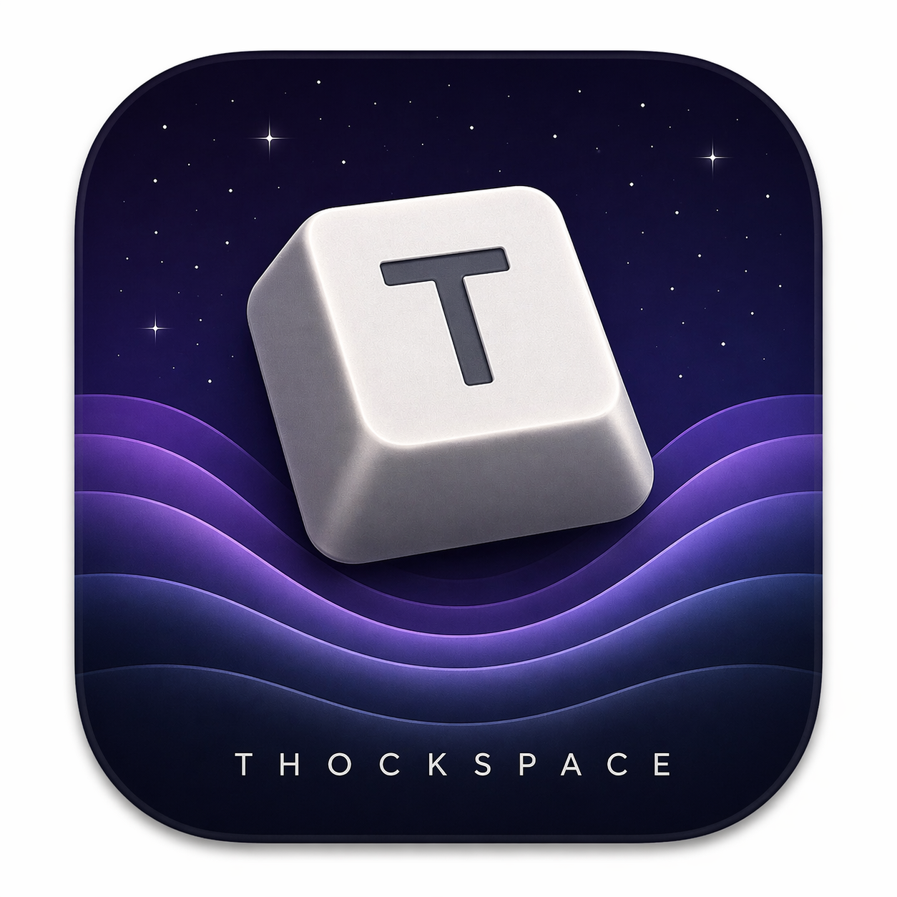

<p align="center">
  
</p>

<h1 align="center">Thockspace</h1>

<p align="center">
  macOS menu bar app. Press key, hear mechanical keyboard thock. HRTF spatial audio on headphones.
</p>

## Features

- **3 built-in sound profiles**: Cherry MX Blue (clicky), Holy Panda (tactile), Cherry MX Red (linear)
- **Custom pack import**: drag-and-drop Mechvibes packs
- **Spatial audio**: HRTF — left keys sound left, right keys sound right
- **Mouse click sounds**: plays through existing audio engine
- **Keystroke stats**: heatmap visualization of key usage
- **24-voice pool**: handles fast typing without glitch
- **Pitch & position jitter**: subtle per-keystroke variation for organic feel
- **Liquid Glass UI**: native macOS 26 Tahoe design
- **Menu bar only**: no Dock icon, lives in menu bar

## Requirements

- macOS 26 Tahoe+
- Input Monitoring permission (prompted on first launch)
- Headphones recommended for spatial audio

## Build

```bash
mise install           # swift 6.3, xcodegen
./scripts/bundle.sh    # debug build
./scripts/bundle.sh release
```

Output: `build/Thockspace.app` (universal binary, arm64 + x86_64, ad-hoc signed)

## Install

```bash
cp -r build/Thockspace.app /Applications/
```

First launch: right-click → Open (Gatekeeper bypass, one time only).

## Project Structure

```
Thockspace/
  ThockspaceApp.swift           # @main, MenuBarExtra
  AppState.swift                # settings + wiring
  Views/
    Theme.swift                  # Liquid Glass design tokens
    SettingsView.swift           # popover UI
    StatsView.swift              # keystroke heatmap
    ManagePacksView.swift        # custom pack management
  Audio/
    AudioEngine.swift            # AVAudioEngine + HRTF spatial
    VoicePool.swift              # 24-voice round-robin with steal
    MechvibesLoader.swift        # parse Mechvibes config.json
    PackImporter.swift           # drag-and-drop pack import
    PackLibrary.swift            # bundled + custom pack registry
    MouseButtonMap.swift         # mouse click → sample mapping
    KeycodeMap.swift             # CGKeyCode → PS/2 scancode
    KeyPositionMap.swift         # CGKeyCode → 3D position
  Stats/
    StatsModel.swift             # keystroke count data model
    StatsRecorder.swift          # event recording
  Input/
    KeyEventTap.swift            # CGEventTap on dedicated thread
    PermissionManager.swift      # Input Monitoring check/request
  Resources/
    AppIcon.icns                 # app icon
    MenuBarIcon.svg              # menu bar keycap icon
    sounds/                      # bundled Mechvibes packs
```

## Sound Packs

Samples from [Mechvibes](https://github.com/hainguyents13/mechvibes), converted to mono WAV 48kHz for spatial audio. Supports both `single` (one file + timestamp sprites) and `multi` (per-key files) pack formats. Custom packs can be imported via drag-and-drop.

## License

Personal use only. Sound samples subject to original Mechvibes pack licenses.
